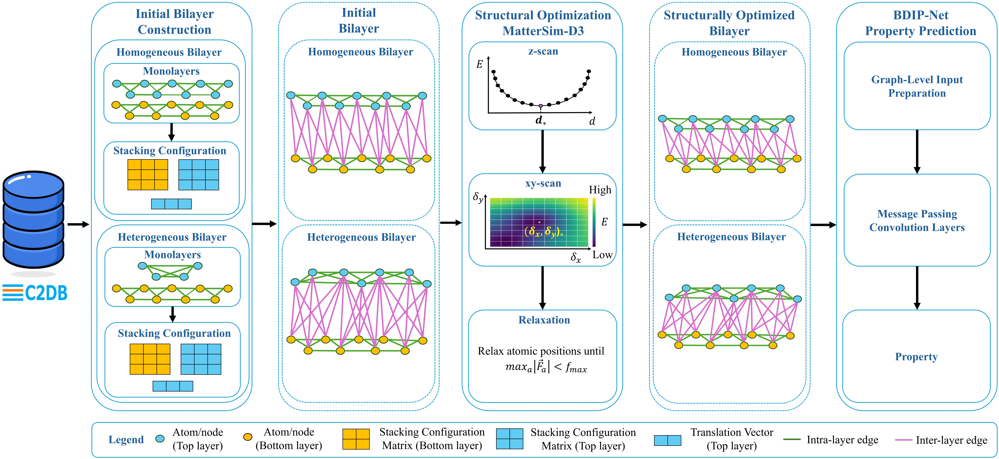

# BDIP-Net: Dual-Interaction Graph Learning for Property Prediction of  Bilayer Materials




## Structural Optimization

Structural optimization is performed using MatterSim. Create and activate the environment:

```bash
conda create -n mattersim python=3.10 -y
conda activate mattersim
```

Install PyTorch with CUDA 12.1 and the required packages:

```bash
pip install torch==2.5.1 torchvision torchaudio \
  --index-url https://download.pytorch.org/whl/cu121

pip install mattersim ase pymatgen pandas numpy scipy dftd3
```

Run the structural optimization script:

```bash
python structural_optimization.py
```
## BDIP-Net Installation

Create and activate a separate environment for BDIP-Net:

```bash
conda create -n bdipnet python=3.10 -y
conda activate bdipnet
```

Install PyTorch with CUDA 12.1:

```bash
pip install torch==2.5.1 torchvision torchaudio \
  --index-url https://download.pytorch.org/whl/cu121
```

Install PyTorch Geometric and its required extension:

```bash
pip install torch_geometric

pip install torch_scatter \
  -f https://data.pyg.org/whl/torch-2.5.1+cu121.html
```

Install DGL and PyTorch Ignite:

```bash
pip install "dgl==1.1.3"

pip install --no-cache-dir "pytorch-ignite==0.5.2"
```

Install the materials-science and data-processing dependencies:

```bash
pip install \
  jarvis-tools \
  pandas \
  pandarallel \
  periodictable \
  PyYAML
```

Install the compatible Pydantic version:

```bash
pip install "pydantic==1.10.15"
```
